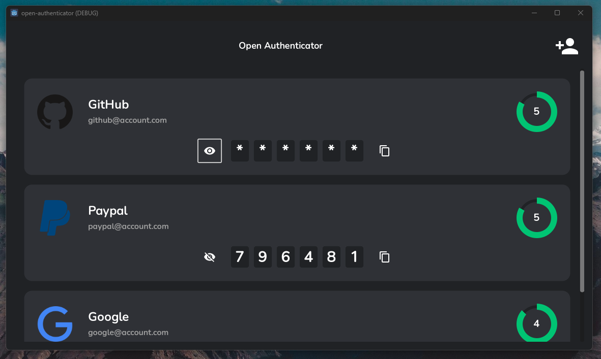
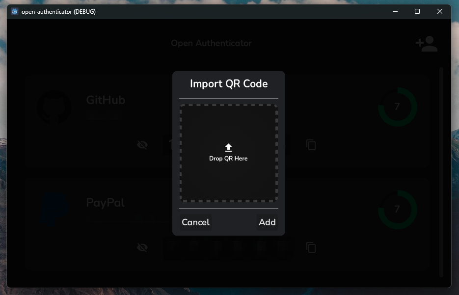

# Open Authenticator

Open source, offline, multiplatform two-factor authenticator software. Alternative to Google and Microsoft authenticator made with Godot Engine 4.

	
	

## Roadmap

- [x] Generate offline RFC6238 compliant One Time Passwords for 2factor authentication
- [x] Offline security for Authenticator accounts
- [x] Read 2fa QR from image
- [x] Frontend improvements
- [ ] Android, iOS and Mac support
- [ ] Improve offline security

