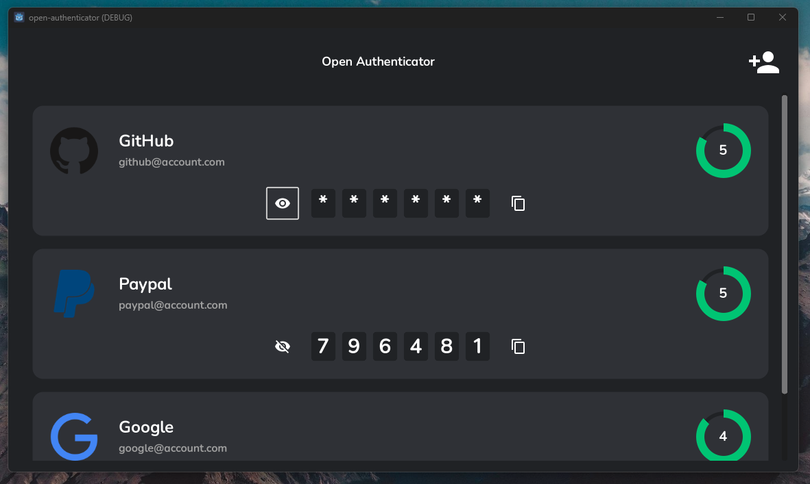
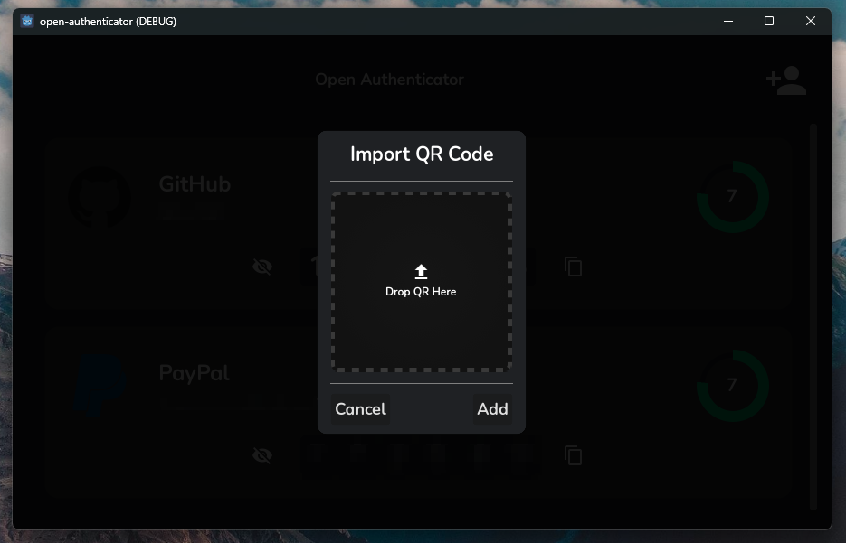

*Open Authenticator* is an open source, offline, multiplatform two-factor authenticator software. Alternative to Google and Microsoft authenticators made with Godot Engine 4.

	
	

## Resources
- Generate HOTP and TOTP with GDScript 👉 [gdscript.otp](https://github.com/fenix-hub/godot-engine.otp)
- Read and Write QRCodes with GDScript 👉 [qrnative](https://github.com/fenix-hub/qrnative)

## Roadmap

- [x] Generate offline RFC6238 compliant One Time Passwords for 2factor authentication
- [x] Offline security for Authenticator accounts
- [x] Read 2fa QR from image
- [x] Frontend improvements
- [ ] Android, iOS and Mac support
- [ ] Improve offline security
